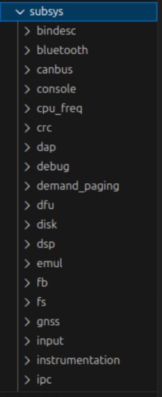

# Zephyr fhLUG

> [!WARNING]
> Everything qemu related was tested on Debian 13. If you are using another distribution, some commands may differ.

> [!WARNING]
> Everything inside the VM related was tested on Ubuntu 22.04 LTS. If you are using another distribution, some commands may differ.

This project was created during the [fhLUG Hagenberg Zephyr Workshop 2025](https://fhlug.at/2025/11/getting-started-with-zephyr-rtos-without-real-hardware/). It provides scripts to setup a virtual machine with a development environment for [Zephyr RTOS](https://www.zephyrproject.org/) as well as a small project that was created during the workshop.

## Getting Started

For getting started, setup your VM manager executing (make sure that you logout and login like the script will tell you):

```bash
./scripts/setup_virtual_machine_management.sh
```

Then catch e.g. an [Ubuntu 22.04 LTS image](https://releases.ubuntu.com/jammy/) and create a new VM with at least `4GB` of RAM, some CPU cores and just to be safe `60GB` of disk space. (NixOS guru [@EdgeLordKirito](https://github.com/EdgeLordKirito) learned the "too less disk space" lesson the hard way...)

Start the VM and copy the `scripts/setup_zephyr.sh` script into the VM (e.g. via copy paste, shared folders or whatever way you prefer).

Execute the script inside the VM:

```bash
./setup_zephyr.sh
```

Now you should have a working Zephyr development environment inside your VM. 🎉

## General information

- it is called "realtime" operating system because it can guarantee that certain tasks will be done within a certain time frame; normal operating systems (e.g. linux) cannot guarantee that because of scheduling, interrupts, etc.
  there is no scheduling in rtos, tasks have priorities and the highest priority task will always be executed first
- main advantage(s) of using rtos
  - when using bare metal
    - have to take care of everything by myself
    - no multitasking
    - no drivers
    - no hw abstraction layer
    - no standardization
  - when using rtos
    - multitasking
    - hw abstraction layer
    - drivers available
    - standardization
    - easier maintenance of code
- differentiation to yocto
  - zephyr is for microcontrollers (small devices with limited resources)
  - yocto is for embedded linux systems (more powerful devices) -> not even rtos

## During the workshop

### Blinky Sample

```bash
cd ~/zephyrproject/zephyr
west build -p always -b native_sim samples/basic/blinky
./build/zephyr/zephyr.exe
```

- build uses DeviceTree (`.dts`) files for defining from code like "which chip do you have? Can you do this feature? This one?" from within the code.
  - like iac but for hardware
  - this device tree file exists for every controller board (we just get it)
- Kconfig = configuration system
  - like menuconfig in linux kernel
  - we can enable/disable features at compile time
  - e.g. enable logging, enable some drivers, etc.
- mapping (alias) from one gpio to another gpio
  - e.g. led0 = gpio1 pin5
  - done via device tree overlays
- looking at generated files
  ```bash
  cat /home/user/zephyrproject/zephyr/build/zephyr/Kconfig/Kconfig.dts # showing kconfig
  cat build/zephyr/zephyr.dts # showing device tree
  ```
- using dtHas to check if feature exists:

  ```c
  #if DT_HAS_NODE(DT_NODELABEL(gpio0))
      // do something with gpio0
  #else
      // gpio0 not available
  #endif
  ```

- many subsystems available in `./subsys/` directory
  

### Using the shell subsystem

```bash
west build -p always -b native_sim samples/subsys/shell/shell_module/
```

- use minicom to connect to the shell we just built

```bash
minicom -D /dev/pts/X  # replace X with the correct pts number
```

- pts = pseudo terminal slave which means it behaves like a serial terminal (serial = old school communication protocol)

- we get the pts number when going in build directory and execute zephyr.exe

- to enable e.g. i2c, we have to adjust project config file `prj.conf` of the module:
- For example append the following lines to enable i2c and shell over serial console with uart console support:

  ```ini
  CONFIG_I2C=y
  CONFIG_SHELL=y
  CONFIG_SHELL_BACKEND_SERIAL=y
  CONFIG_UART_CONSOLE=y
  ```

- for shell module path to project file is `/home/user/zephyrproject/zephyr/samples/subsys/shell/shell_module/prj.conf`
- see code in `/home/user/zephyrproject/zephyr/samples/subsys/shell/shell_module/src/main.c`

```c
SHELL_CMD(ping, NULL, "Ping command.", cmd_demo_ping), -> the ping is not a string because SHELL_CMD is macro and under the hood it will use the #name operator to convert it to string
SHELL_CMD_REGISTER = define command i then can execute in the shell
```

## References

- [Device Tree](https://www.devicetree.org/)
- [KConfig](https://docs.zephyrproject.org/latest/build/kconfig/index.html)
- [Minicom](https://wiki.emacinc.com/wiki/Getting_Started_With_Minicom)
